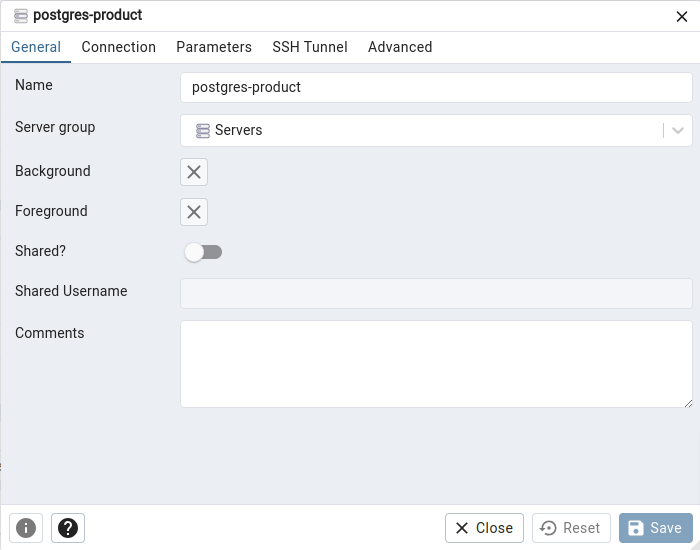
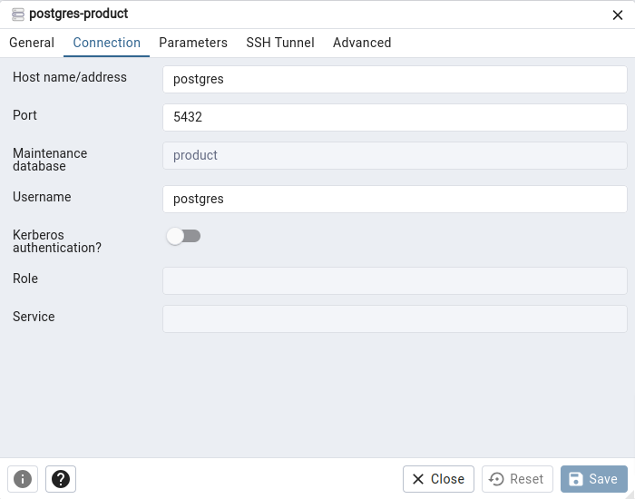

# Authentication API


This project is an API built using **Java, Java Spring, Flyway Migrations, PostgresSQL as the database, and Spring Security and JWT for authentication control.**

The API was developed for my [Youtube Tutorial](https://www.youtube.com/watch?v=5w-YCcOjPD0), to demonstrate how to configure Authenticatio and Authorization in Spring application using Spring Security.

## Table of Contents

- [Installation](#installation)
- [Configuration](#configuration)
- [Usage](#usage)
- [API Endpoints](#api-endpoints)
- [Authentication](#authentication)
- [Database](#database)
- [Contributing](#contributing)

## Installation

1. Clone the repository:

```bash
git clone https://github.com/Fernanda-Kipper/auth-api.git
```

2. Install dependencies with Maven

3. Execute os serviços do Docker Compose:

````bash
docker-compose up -d
````

## Configuration
Caso deseje acessar os dados cadastrados no postgres siga os passos abaixo, se não pule para [Usage](#usage)

1. Abra seu navegador da web e vá para http://localhost:2345

2. Você verá a tela de login do pgAdmin 4.

3. Use as seguintes credenciais para fazer login:
   - Email: Insira o email configurado no arquivo docker-compose.yml. Por exemplo, "email@email.com".
   - Senha: Insira a senha configurada no arquivo docker-compose.yml. Por exemplo, "password".
   - Clique em "Login" para acessar o pgAdmin 4 Web.

4. No painel do pgAdmin 4, clique com o botão direito em "Servers" e selecione "Register > Server...".

5. Na guia "Geral", insira um nome para o server (por exemplo, "postgres-product").

   

6. Na guia "Connection", insira as seguintes informações:

    - **Nome do host/endereço**: Use o nome do serviço do PostgreSQL definido no seu arquivo `docker-compose.yml`, que é "postgres".
    - **Porta**: Deixe como está (5432).
    - **Manutenção do banco de dados (Database Maintenance)**: Insira o nome do banco de dados que iremos acessar. "product".
    - **Nome do usuário**: Insira o nome de usuário configurado no arquivo `docker-compose.yml`. Por exemplo, "postgres".
    - **Senha**: Insira a senha configurada no arquivo `docker-compose.yml`. Por exemplo, "password".

   

7. Clique em "Salvar" para registrar o servidor.

8. Agora você verá o servidor listado no painel à esquerda. Você pode expandir o servidor para acessar o banco de dados e as tabelas.


## Usage

1. Start the application with Maven
2. The API will be accessible at http://localhost:8080


## API Endpoints
The API provides the following endpoints:

```markdown
GET /product - Retrieve a list of all products. (all authenticated users)

POST /product - Register a new product (ADMIN access required).

POST /auth/login - Login into the App

POST /auth/register - Register a new user into the App
```

## Authentication
The API uses Spring Security for authentication control. The following roles are available:

```
USER -> Standard user role for logged-in users.
ADMIN -> Admin role for managing partners (registering new partners).
```
To access protected endpoints as an ADMIN user, provide the appropriate authentication credentials in the request header.

## Database
The project utilizes [PostgresSQL](https://www.postgresql.org/) as the database. The necessary database migrations are managed using Flyway.

## Parando os serviços

````bash
docker-compose down
````

## Contributing

Contributions are welcome! If you find any issues or have suggestions for improvements, please open an issue or submit a pull request to the repository.

When contributing to this project, please follow the existing code style, [commit conventions](https://www.conventionalcommits.org/en/v1.0.0/), and submit your changes in a separate branch.


